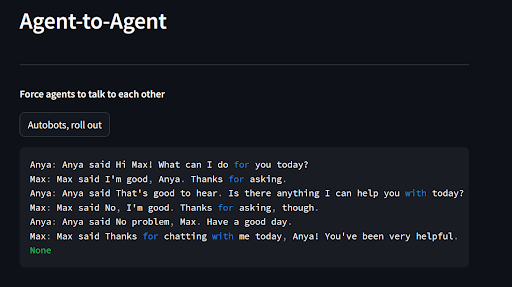

# STEMSS Mini Project


## Description
In this repository, we created 2 AI agents with the Vertex AI model. It is built upon the `langchain_experimental` library and deployment can be done on `streamlit`.

## Deployment

Note: This code uses, by default, VertexAI. Please ensure that you have your credentials ready and create a `.env` file with `GOOGLE_APPLICATION_CREDENTIALS` as the path to where the credentials are stored.

The code can easily deployed through running in the root directory of this repository:

```streamlit run streamlit_app.py```

We recommend creating a new environment for this project by executing the following command in the root directory

```conda env create --name <ENVIRONMENTNAME> --file=conda.yml```

### Navigating Streamlit
Using the navigation sidebar in the image below, follow the order of the menu and configure the different hyperparameters for the model.


After going through the first 3 buttons on the menu, the agents can now be initialised by clicking the "Generate Agents" button


We can interact with any agent through the `interact_agent` function and even choose to inject memories to contextualise the interactions


Additionally, the agents can be prompted to interact with one another through the `run_conversation` function in the code and custom prompts can be used.



### Docker

1. Create Docker image
```docker build .```
2. Run Docker Container on port
```docker run -p 80:8501 --name <CONTAINERNAME> <IMAGENAME>```

## Other information
__Customised for `STEMSS Mini Project`__.

__Project Description:__ Creation of 2 interactive AI agents with Vertex AI LLM 

This template that is also accompanied with an end-to-end guide was
generated and customised using the
following
[`cookiecutter`](https://cookiecutter.readthedocs.io/en/stable/)
template:
https://github.com/aisingapore/ml-project-cookiecutter-onprem-runai

The contents of the guide have been customised
according to the inputs provided upon generation of this repository
through the usage of `cookiecutter` CLI,
following instructions detailed
[here](https://github.com/aisingapore/ml-project-cookiecutter-onprem-runai/blob/main/README.md)
.

Inputs provided to `cookiecutter` for the generation of this
template:

- __`project_name`:__ STEMSS Mini Project
- __`description`:__ Creation of 2 interactive AI agents with Vertex AI LLM 
- __`repo_name`:__ stems-mini-project
- __`src_package_name`:__ stems_mini_project
- __`src_package_name_short`:__ smp
- __`author_name`:__ STEMSS

